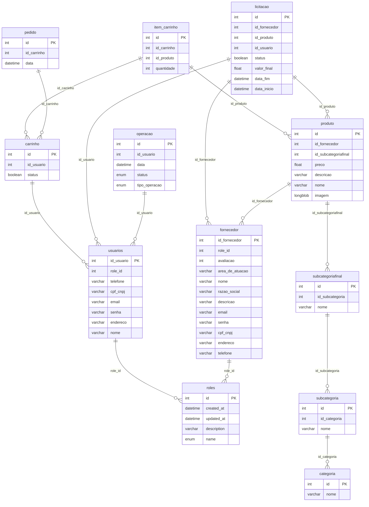

<h1 align="center">TCC EQUIPE - 03 Etec Uirapuru - Desenvolvimento de Sistemas</h1>
<h2 align="center">projeto: OrçaTudo</h2>

O projeto ORÇATUDO tem como objetivo ser um sistema web que facilita a cotação e licitação de materiais de contrução e ferramentas

<h3>Tecnologias utilizadas: HTML,CSS,Javascript,Java Com Spring Boot</h3>

<h4>Equipe:</h4>

-  **Murilo Miranda Verçosa**

-  **João Pedro Xavier**

-  **Otávio Franklin**

-  **Alex Alves da Silva**

-  **João Pedro Menezes**

 <h3 align="center">Foco é a ponte entre seus sonhos e suas conquistas</h3>
 

<h3>Modelo de Entidade Relacionamento lógico</h3>

